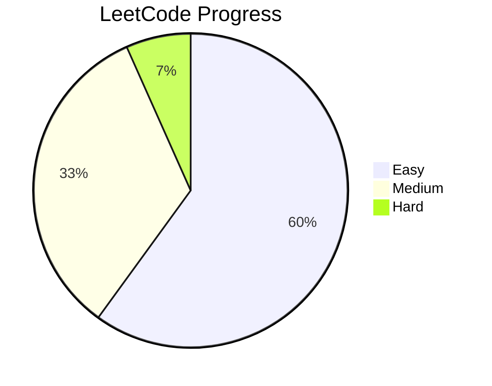
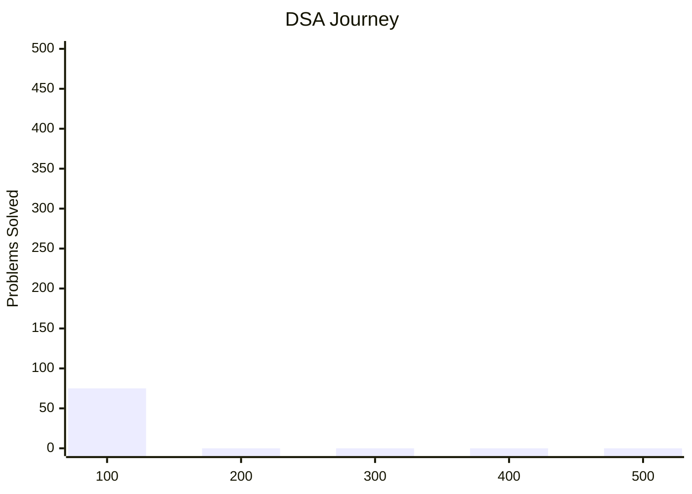
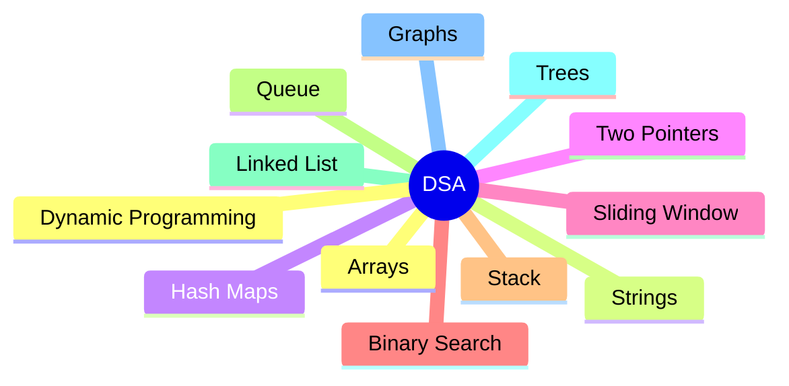
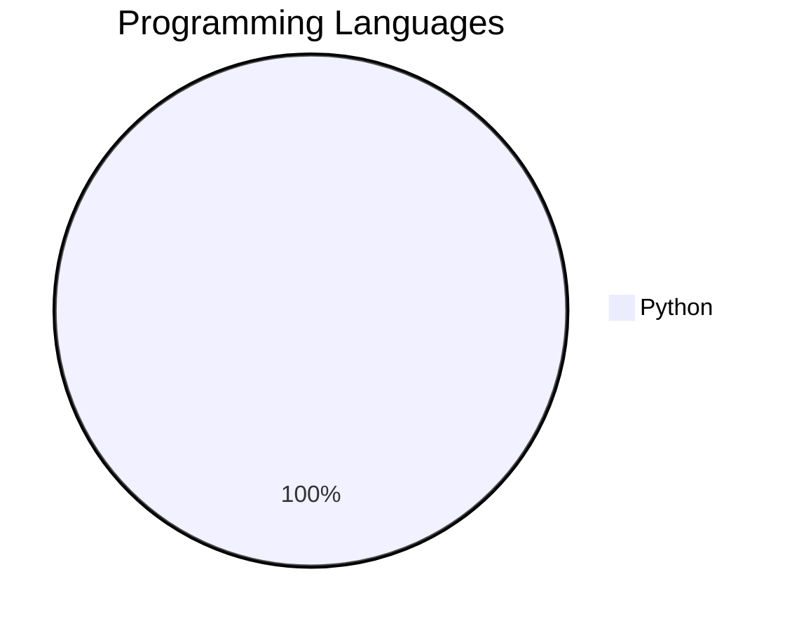
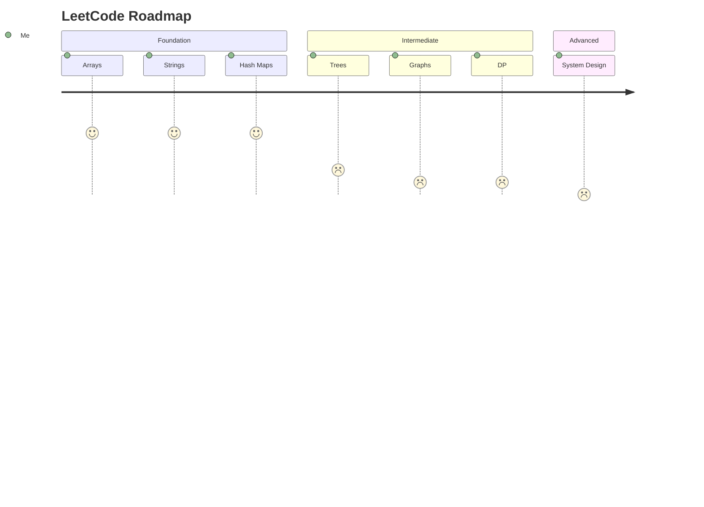

# 🚀 LeetCode Solutions

My personal LeetCode journey to master Data Structures & Algorithms.

## 📈 Progress Overview

## 🎯 Target Roadmap

## 🧠 Topics Covered

## 🛠 Language Usage

## 🔥 Current Goal

## 📊 Statistics

| Metric | Count |
|---------|---------|
| Total Solved | 75 |
| Easy | 45 |
| Medium | 25 |
| Hard | 5 |

## 📈 LeetCode Profile

[My LeetCode Profile](https://leetcode.com/u/RISHAD_777)

## 🌟 Goals

- Solve 300+ LeetCode problems
- Master DSA patterns
- Crack Product-Based Company Interviews
- Become a Python Full Stack Developer

---
⭐ Consistency beats intensity.
